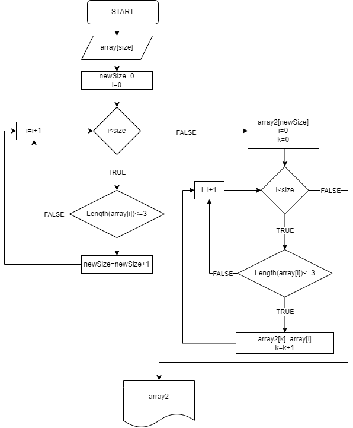

# **Итоговая контрольная работа**

Необходимо написать программу, которая из имеющегося массива строк формирует новый массив из строк, длина которых меньше, либо равна 3 символам. Первоначальный массив можно ввести с клавиатуры, либо задать на старте выполнения алгоритма. При решении не рекомендуется пользоваться коллекциями, лучше обойтись исключительно массивами.

# *Решение*
Первоначальный массив пользователь вводит с клавиатуры. Хатем программа считает количество удовлетворяющих условию задачи элементов в первоначальном массиве. Затем создается массив необходимой размерности. После этого еще раз перебирается первоначальный массив и  удовлетворяющии условию элементы записываются в новый массив.

# *Алгоритм*
Алгоритм решения представлен на болок-схеме
